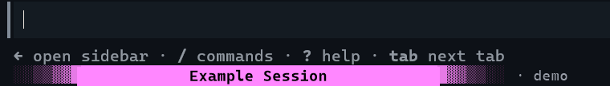

# Copilot Session Color

Give each GitHub Copilot CLI session a distinct statusline.

> [!IMPORTANT]
> **Install command not working?** If `gh` reports
> `unknown command "skill"`, update GitHub CLI to 2.90 or later with
> `winget upgrade --id GitHub.cli -e`, reopen PowerShell, and see
> [Troubleshooting](docs/troubleshooting.md#unknown-command-skill-for-gh).



## Install

```powershell
gh skill preview alejo-valencia/copilot-session-color color
gh skill install alejo-valencia/copilot-session-color color --agent github-copilot --scope user
```

Then:

```text
/skills reload
/color green
```

If this is the first `/color` command in the session and the statusline does
not appear, run `/restart` once to apply it.

Also accepts hex, ANSI 256-color values, and automatic selection:

```text
/color #7C3AED
/color 208
/color automatic
```

Unnamed sessions display `Copilot session`. Run `/rename` with no argument to
generate a name from the conversation, or `/rename <name>` to choose one.
The center is always 35 characters, with centered text, `...` truncation, and
a solid session-color background. Only the outer bars use a gradient.

The `/color` prompt is processed by the session's active model. Agent Skills
cannot select a cheaper model per invocation; the actual configuration change
is performed locally by deterministic PowerShell scripts.

## Requirements

Windows 10 or later, PowerShell 7, GitHub Copilot CLI, and GitHub CLI 2.90 or
later.

Configuration stays under `%USERPROFILE%\.copilot\session-color\` and no
telemetry or network calls are made by the runtime scripts.

## Documentation

- [Behavior and model selection](docs/behavior.md)
- [Configuration](docs/configuration.md)
- [Troubleshooting](docs/troubleshooting.md)
- [Architecture](docs/architecture.md)
- [Extensibility investigation](docs/extensibility-investigation.md)

Update with `gh skill update color`, then `/skills reload` and
`/color install`. Remove with `/color uninstall` followed by
`copilot skill remove color`.

[MIT](LICENSE)
